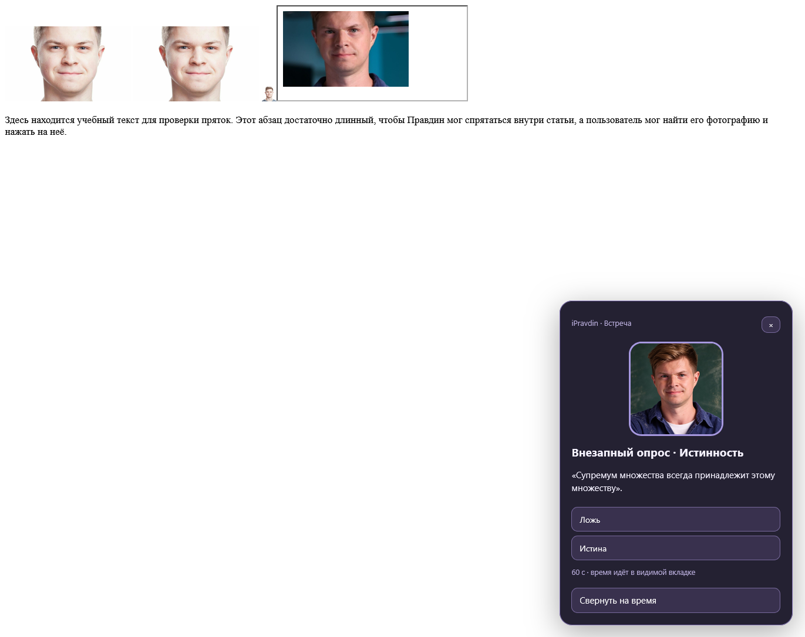
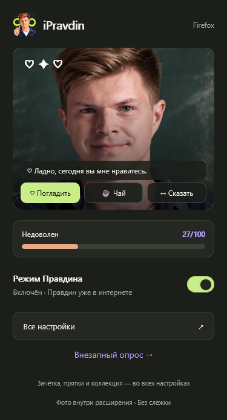
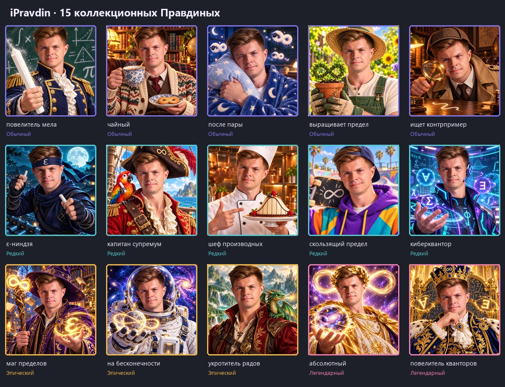

# iPravdin для Firefox

Правдин теперь живёт в вашем браузере: появляется на сайтах, спрашивает матан, прячется в статьях и иногда попадается в редком костюме. Его можно погладить, угостить чаем и поймать в коллекцию.

## Скачать и установить

**[Скачать последнюю подписанную версию iPravdin](https://github.com/BongAchiver/iPravdin/releases/latest/download/ipravdin.xpi)** · [Все выпуски](https://github.com/BongAchiver/iPravdin/releases)

Нужен Firefox 140 или новее на компьютере.

1. Скачайте `ipravdin.xpi` по ссылке выше.
2. Откройте `about:addons` в Firefox.
3. Нажмите шестерёнку → **Установить дополнение из файла…** и выберите скачанный файл.
4. Подтвердите установку и доступ к сайтам. Обновите уже открытые страницы.
5. Нажмите значок iPravdin на панели браузера. Кнопка **Все настройки** откроет зачётку, коллекцию и управление игрой.

Firefox получает следующие обновления с GitHub автоматически, если автообновления дополнений включены. Новая версия может появиться не сразу; проверить обновления вручную можно в `about:addons` через меню шестерёнки.

В релизах лежит подписанный Mozilla XPI для постоянной установки. Публикация в каталоге Mozilla Add-ons не требуется. Android пока отдельно не проверялся.

## Что умеет Правдин

### Подменять фотографии

Обычные картинки на страницах заменяются двумя фотографиями Правдина. Подмена работает и с картинками, которые сайт добавил после загрузки. Мелкие иконки по умолчанию остаются на месте.

Можно выключить подмену и сразу вернуть исходные изображения, добавить сайты в исключения или пользоваться переключателем в меню правой кнопки мыши. Исключения распространяются и на поддомены.

### Внезапно спрашивать матан

Иногда в углу страницы появляется вопрос. В банке 20 задач:

- определения предела и непрерывности с кванторами;
- отрицания высказываний и определений;
- истинные и ложные утверждения с контрпримерами;
- инфимум и супремум;
- пределы и производные.

Выберите вариант ответа — Правдин покажет правильный ответ и объяснение. Варианты каждый раз перемешиваются. На вопрос даётся минута; время идёт только в видимой вкладке. Окошко можно свернуть или пропустить.

Чтобы позаниматься сразу, нажмите **Решить задачу**. На учебной странице вопрос появляется в центре, даже если подмена фотографий и случайные события выключены. Есть и **Билет дня**: три разных вопроса, новый билет каждый день. За три верных ответа — бонус к баллам. Начатую встречу можно продолжить в течение 15 минут; после закрытия вкладки новый билет будет доступен завтра. При ошибке запуска страница показывает причину и кнопку повторного запуска.

### Вести зачётку и менять настроение

Правдин помнит верные ответы, баллы, текущую и лучшую серии. Решаете правильно — доволен. Ошибаетесь или пропускаете — начинает ждать вас на пересдаче.

| Действие | Результат |
| --- | --- |
| Верный ответ | +10 баллов, +7 настроения |
| Ошибка | −6 настроения и объяснение решения |
| Пропуск опроса | −3 настроения |
| Билет: 3 из 3 | Ещё +20 баллов |
| Найти Правдина в прятках | +25 баллов, +10 настроения |
| Собрать карточку на странице | +15 баллов и экземпляр в коллекцию |

### Принимать ласку и чай

Поводите курсором по голове Правдина в игровом окне или нажмите на неё — можно погладить. Это повышает настроение на 3, но награда выдаётся не чаще раза в 30 секунд.

В меню значка расширения, рядом с переключателем режима, есть живая шкала настроения. Кнопки **Погладить**, **Чай** и **Сказать** расположены поверх портрета. Поводите курсором по голове: появляются сердечки, Правдин отвечает и меняет выражение лица. При низком настроении он строгий, при хорошем улыбается, а после чая ненадолго появляется чайный Правдин. Такие же взаимодействия есть во **Всех настройках**. Чай даёт +2 настроения раз в пять минут. Когда Правдин просто наблюдает, чай и диалоги доступны прямо в его окне.

### Собираться в коллекцию

В расширении **15 отдельных иллюстраций Правдина**, созданных с помощью ИИ по его фотографии. У каждого свой костюм, реквизит и фон.

| Редкость | Кто может встретиться | Шанс категории среди карточек |
| --- | --- | --- |
| Обычный · 5 вариантов | Повелитель мела, чайный, после пары, садовник пределов, сыщик контрпримеров | 65% |
| Редкий · 5 вариантов | ε-ниндзя, капитан супремум, шеф производных, скейтер, киберквантор | 25% |
| Эпический · 3 варианта | Маг пределов, космонавт, укротитель рядов | 8,5% |
| Легендарный · 2 варианта | Абсолютный, повелитель кванторов | 1,5% |

Иногда вместо обычного фото Правдина на сайте появляется **коллекционная иллюстрация с цветной рамкой**. Нажмите прямо на неё: карточка сохранится в коллекцию, а эта картинка станет обычным Правдиным. Клик по карточке не открывает ссылку сайта. До первой поимки её слот в коллекции скрыт. После поимки можно рассмотреть картинку крупно. Повторные экземпляры тоже считаются.

При первой подмене каждой подходящей картинки размером от 96 × 96 шанс карточки — **4%**. Одновременно на вкладке может быть до трёх карточек. Также карточку может добавить запланированное событие. Сначала случайно выбирается редкость, затем с равным шансом один из вариантов этой категории. Например, каждый из двух легендарных имеет шанс 0,75% среди выпавших карточек. Гарантированного выпадения и защиты от повторов нет.

### Играть в прятки

Нажмите **Начать прятки** во **Всех настройках**. Подсказка ведёт к одной из статей русской Википедии о пределах, непрерывности или верхних и нижних гранях. Можно найти статью самостоятельно или открыть её кнопкой-подсказкой.

Маленькое фото Правдина спрятано внутри случайного абзаца. Найдите и нажмите на него. На странице активного квеста обычная подмена фотографий временно отключается, чтобы вам было кого искать. Поиск можно отменить.

## Как часто он появляется

По умолчанию следующая встреча планируется через **5 минут**. Можно выбрать 5, 10, 30 или 60 минут. При обновлении прежний стандартный интервал 30 минут меняется на 5; прогресс сохраняется.

Когда приходит время и открыта подходящая видимая вкладка, выбирается событие:

- **55%** — вопрос по матану;
- **25%** — коллекционная карточка вместо картинки сайта;
- **20%** — Правдин наблюдает и разговаривает.

Одновременно активна одна встреча на весь браузер. Если вкладка скрыта или предыдущая встреча ещё открыта, новая подождёт. Для карточки нужна подходящая картинка на странице. На исключённых сайтах события не появляются. Игру можно выключить отдельно от подмены фотографий. Прятки запускаются вручную.

## Проверить всё без ожидания

Откройте **Все настройки → Лаборатория Правдина**, включите **Режим отладки** и выберите открытую вкладку обычного сайта. Кнопками можно немедленно вызвать вопрос, тестовый билет, наблюдение или карточку. Для карточки можно выбрать конкретного Правдина из всех 15 вариантов; на странице должна быть подходящая картинка и включена подмена.

В лаборатории настраиваются интервал в секундах, шанс карточки на новую картинку, веса трёх событий и четырёх редкостей. Веса не обязаны давать сумму 100: вероятность считается относительно их суммы. Нулевой вес исключает вариант, все нули отключают соответствующий случайный выбор. **Вернуть обычные значения** восстанавливает стандартные шансы и интервал 5 минут.

Тестовый билет доступен повторно в тот же день. Отладка сохраняет настоящие баллы, настроение и коллекцию. После проверки выключите режим отладки, чтобы вернуться к интервалу в минутах.

## Где хранятся данные

Настройки, зачётка, настроение и коллекция сохраняются на этом устройстве. Расширение не отправляет прогресс, историю и содержимое страниц на сервер и не содержит аналитики. Синхронизации между устройствами нет.

Статьи для пряток открываются как обычные сайты; обновления скачивает сам Firefox с GitHub. При обновлении настройки и прогресс сохраняются. Удаление расширения удаляет его локальные данные.

## Ограничения

- Внутренние страницы Firefox, каталог Mozilla Add-ons и некоторые защищённые страницы недоступны расширению.
- Подмена работает с HTML-картинками; CSS-фоны, canvas, shadow DOM и встроенный просмотрщик PDF не меняются.
- Подмена может закрыть важную картинку или QR-код. Добавьте такой сайт в исключения или выключите её.
- Если сайт блокирует фотографию расширения, возвращается исходная картинка. Прятки зависят от доступности выбранной статьи.

## Для разработчиков

Исходники расширения находятся в `app/`. Проверки: `npm test`, `npm run lint`, `npm run build`, `npm run test:firefox` (Firefox на Windows). Push в `main` запускает автоматическую подпись Mozilla и публикацию обновления в GitHub Releases.

Оригинальные фотографии предоставлены пользователем; сведения об изображениях — в [CREDITS.txt](app/ipravdin/photos/CREDITS.txt). Иллюстрации, новая иконка, баннер и реакции портрета созданы встроенным генератором изображений по фотографиям Правдина. Промпты: [коллекция](art/collectibles/prompts.json), [иконка, баннер и реакции](art/branding/prompts.json). Расширение основано на [iNikolayev-v.2](https://github.com/vint352/iNikolayev-v.2). Подробнее о разрешениях — в [SECURITY.md](SECURITY.md).
